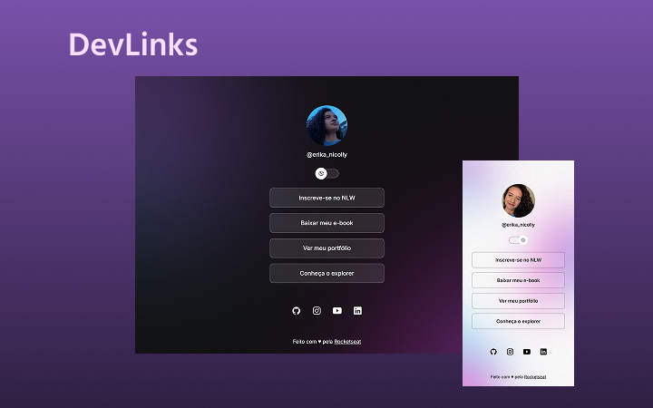

<h1 align="center"> DevLinks </h1>

  

 

## 🚀 Tecnologias

Esse projeto foi desenvolvido com as seguintes tecnologias:

- HTML 
- CSS
- JavaScript
- Figma

 

## 💻 Projeto
Programa exclusivo e gratuito, promovido pela Rocketseat para ensino de tecnologias WEB.
 
O DevLinks é um agregador de links para usar como cartão de visitas online.

 

## 🔖 Layout

Você pode visualizar o layout do projeto através [DESSE LINK](https://www.figma.com/design/zEmaXC8a3fSUf2XNpqwPi7/DevLinks-%E2%80%A2-Projeto-Discover-(Community)?node-id=10-620&p=f&t=25KVmduWKkY1czoZ-0).

 

## 🌐 Acesse o projeto
👉 [DevLinks](https://erika-nicolly.github.io/DevLinks/#)

 

Feito com ♥ by Rocketseat :wave: [Participe da nossa comunidade!](https://discord.gg/rocketseat)